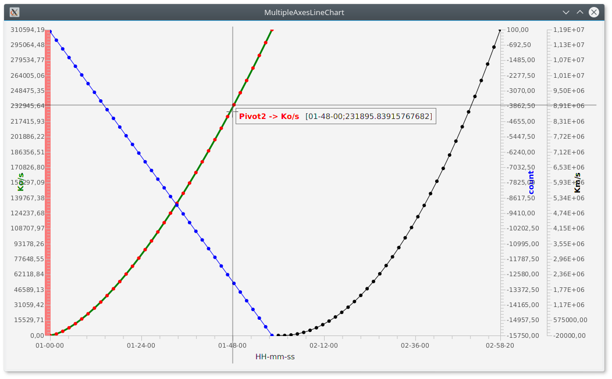
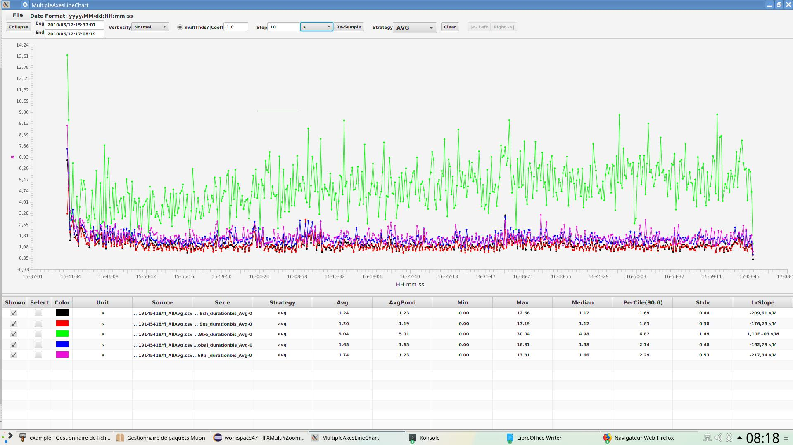

<!DOCTYPE HTML PUBLIC "-//W3C//DTD HTML 4.0 Transitional//EN">
<html>
<head>
	<meta http-equiv="content-type" content="text/html; charset=utf-8"/>
	<title></title>
	<meta name="generator" content="LibreOffice 5.4.5.1 (Linux)"/>
	<meta name="created" content="2017-11-20T11:24:41.257874917"/>
	<meta name="changed" content="2018-03-27T08:39:50.256248008"/>
	
</head>
<body lang="en-US" dir="ltr">

<b>JFXMultiZoomLineChartYAxis</b>

<ol>
	<li/>
<h1 class="western">LineChart multi Y-Axis</h1>
</ol>

 

At this time, with
JFX / SDK 9, there is no native LineChart with several YAxis.

For my needs i
want&nbsp;:

- a XAxis shared by
all the LineChart, it is a NumberAxis.

- the Xaxis can be a
time/date Axis ( in fact long since 01/01/1970 that can be formated
to date/Time =&gt; TickFormater / StringConverter)

- Several YAxis with
differents Units

- the LineCharts
must be Zoomable.

For not reinventing
the wheel, i search what exists on Internet..

 

The aim of my work
is the class developed by <a href="https://gist.github.com/MaciejDobrowolski">MaciejDobrowolski</a>&nbsp;:

<a href="https://gist.github.com/MaciejDobrowolski/9c99af00668986a0a303">https://gist.github.com/MaciejDobrowolski/9c99af00668986a0a303</a>

 

For the automatic
choose of TickFormater formating of the date/time, I get the tips ( 2
arrays) used here : 

<a href="https://github.com/dukke/FXCharts/blob/master/DateAxis.java">https://github.com/dukke/FXCharts/blob/master/DateAxis.java</a>

 

For Zooming, I start
from : 

<a href="https://gist.github.com/james-d/7252698">https://gist.github.com/james-d/7252698</a>

 

I mixed the 3
sources and with a little personal work, I can obtain the result
below :

 

 

I developped it with
SDK 9 Oracle, but perhaps it is possible to compil the source with
SDK8. JFX has not very changed between the two versions. 

 

There are some
examples in the package org.jlp.javafx.example

You can take the jar
at the root and launch it for example as :

 

<i>/pathToJdk9Bin/-Xms1024M
-Xmx1024M --module-path /pathToTheJarFile -m
org.jlp.javafx/org.jlp.javafx.example.ZoomableLineChartsMultiYAxisMainXDate</i>

 

 

<ol start="2">
	<li/>
<h1 class="western">Charting with CSV files</h1>
</ol>

The class <b>org.jlp.javafx.example.CSVChartViewerMain</b> is the
main class to graph some csv files which must respect some
conditions:

The first line is the title, with the mandatory format below :

<b>DateTime</b>;<b>Pivots</b>;Value1(hit/s);Value2(ms);

The
first column is a <b>DateTime</b> ( The title must contains <b>Date</b>
or/And <b>Time</b> in the name). The format of the date must be
handled by regex and Java DateFormat described in file
<b>./config/logFouineurDates.properties. </b>If the format is not
recognized, it must be added into yjis file ( Be care to do a backup
of this file before modifying it, it is a bit tricky).

The
second column <b>Pivots</b>, is optionnal, and is useful to sort the
values ( Exemple different kind of URL after parsing an http access
log file).

The
others column are <b>Values,</b> between parenthesis, you indicate
the unit of the value. If absent a default “unit” is attributed.

The semi-colon is the csv
field separator.

The tool allows to have
several Y-Axis.

Read the quick manual in
manual repository.

A script to launch it on a
Linux desktop :

JAVA_HOME=/opt/<u>jdk</u>-9.0.4

root=/opt/workspace47/JFXMultiYZoomLineChart

workspace=/opt/workspaceLP

$JAVA_HOME/bin/java
-Xms1024M -Xmx1024M -<u>Droot</u>=$root
-<u>Dworkspace</u>=$workspace
--module-path $root/<u>libs</u>
-m
org.jlp.javafx/org.jlp.javafx.example.CSVChartViewerMain

 

The same on a Windows
desktop :

set
JAVA_HOME=C:\Program Files\Java\<u>jdk</u>-9.0.4

set
root=C:\opt\workspace47\JFXMultiYZoomLineChart

set
workspace=C:\opt\workspaceLP

&quot;%JAVA_HOME%\bin\java&quot;
-Xms1024M -Xmx1024M -<u>Droot</u>=%root%
-<u>Dworkspace</u>=%workspace%
--module-path %root%\<u>libs</u>
-m
org.jlp.javafx/org.jlp.javafx.example.CSVChartViewerMain

 

 
 

Below a screen shot:

 
 

 
 

for the csv file :

DateTime;POSTkrmx69es_durationbis_Avg(s);POSTkrmx69be_durationbis_Avg(s);POSTkrmx69ch_durationbis_Avg(s);POSTkrmx69pl_durationbis_Avg(s);global_durationbis_Avg(s);

2010/05/12:15:41:14;4.83045924137931;16.277920499999997;7.42722225;10.972653499999998;8.432598881355931;

2010/05/12:15:41:15;4.059669388888889;16.774655631578945;10.7794122;13.80661;9.79711650617284;

2010/05/12:15:41:16;1.9068376666666669;20.306890666666664;7.410049;;10.578747714285715;

2010/05/12:15:41:17;1.3363226666666665;13.781568666666665;4.5099730000000005;6.431179;6.267221892857142;

2010/05/12:15:41:18;0.1924879024390244;7.612964549999998;3.5619031999999997;4.734340499999999;2.756316058823529;

2010/05/12:15:41:19;7.145098851851851;6.7216338124999995;;;7.0483068428571425;

</body>
</html>