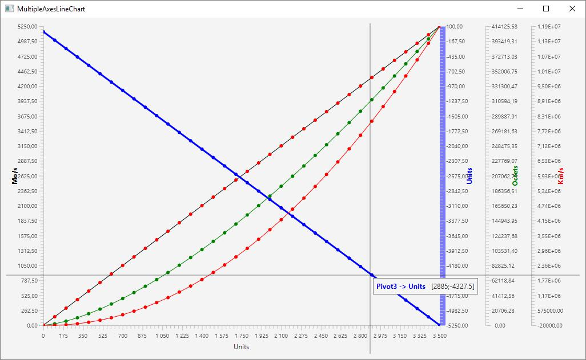

<!DOCTYPE HTML PUBLIC "-//W3C//DTD HTML 4.0 Transitional//EN">
<HTML>
<HEAD>
	<META HTTP-EQUIV="CONTENT-TYPE" CONTENT="text/html; charset=windows-1252">
	
</HEAD>
<BODY LANG="en-US" DIR="LTR">

<B>JFXMultiZoomLineChartYAxis</B>

At this time, with
JFX / SDK 9, there is no native LineChart with several Yaxis.

For my needs I
want&nbsp;:

- a XAxis shared by
all the LineCharts, it is a NumberAxis.

- the Xaxis can be a
time/date Axis ( in fact long in millis seconds since 01/01/1970 that
can be formated to date/Time =&gt; TickFormater / StringConverter)

- Several YAxis with
differents Units

- the LineCharts
must be Zoomable.

For not reinventing
the wheel, I search what already exist on Internet..

The aim of my work
is the class developed by <A HREF="https://gist.github.com/MaciejDobrowolski">MaciejDobrowolski</A>&nbsp;:

<A HREF="https://gist.github.com/MaciejDobrowolski/9c99af00668986a0a303">https://gist.github.com/MaciejDobrowolski/9c99af00668986a0a303</A>

For the automatic
choose of TickFormater formating of the date/time, I get the tips ( 2
arrays) used here : 

<A HREF="https://github.com/dukke/FXCharts/blob/master/DateAxis.java">https://github.com/dukke/FXCharts/blob/master/DateAxis.java</A>

For Zooming, I start
from : 

<A HREF="https://gist.github.com/james-d/7252698">https://gist.github.com/james-d/7252698</A>

I used JDK9 /
Eclipse Oxygen/Gradle. I mixed the 3 sources and with a little
personal work, I can obtain the result below :

I developped it with
SDK 9 Oracle, but perhaps it is possible to compil the source with
SDK8. JFX has not very changed between the two versions. 

The License is<A HREF="http://www.apache.org/licenses/LICENSE-2.0.html">
Apache 2.0.</A>

There are some
examples in the package org.jlp.javafx.example

You can take the jar
in a folder and launch it for example as :

<B>/pathToJdk9Bin/java
-Xms1024M -Xmx1024M --module-path /pathToTheJarFile -m
org.jlp.javafx/org.jlp.javafx.example.ZoomableLineChartsMultiYAxisMainXDate</B>

The
archive jar, containing the module is org.jlp.javafx is
<B>libs/JFXMultiYZoomLineChart.jar</B>

The command below becomes :

<B>/pathToJdk9Bin/java
-Xms1024M -Xmx1024M --module-path /pathToParentOf_libs/libs -m
org.jlp.javafx/org.jlp.javafx.example.ZoomableLineChartsMultiYAxisMainXDate</B>

<I>If you want to
test in older versions of JDK, you have to modify the JDK Source and
Target in build.gradle and rename file <B>module-info.java </B>( to
module-info.java.no_use for example).</I>

I will continue to
improve these classes. Next step =&gt; coupling a TableView with the
LineCharts synchronized with the zoom in and reset actions.

</BODY>
</HTML>